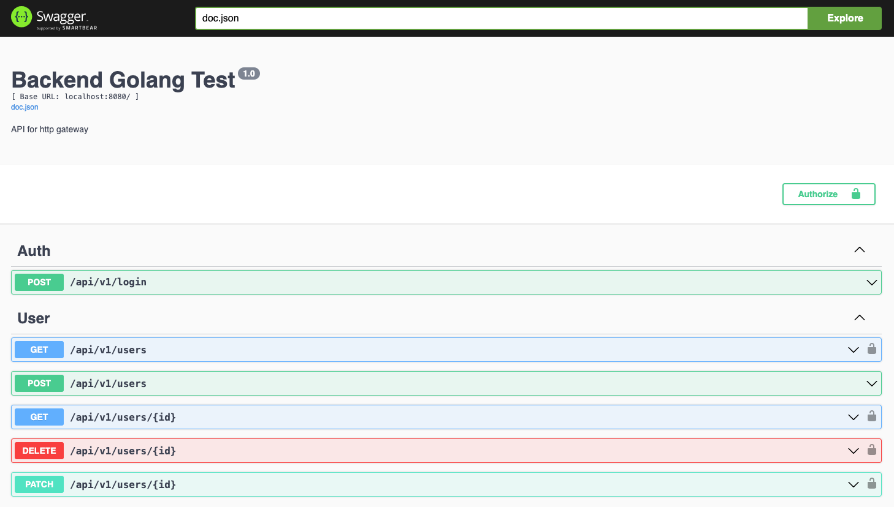
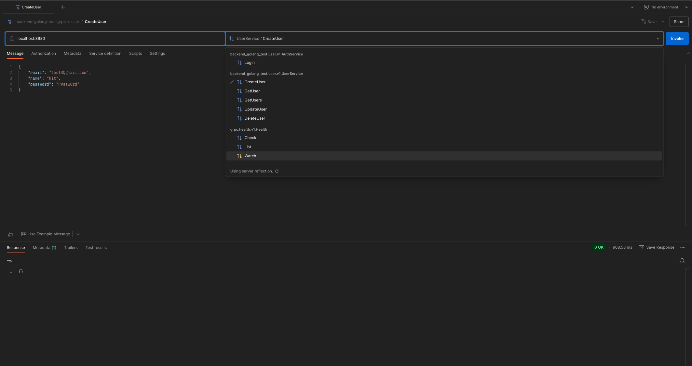

# Backend Golang Test

## Prerequisites
- Go (version 1.21 or newer)
- Docker and Docker Compose
- Make
- Buf
- `protoc-gen-go` & `protoc-gen-go-grpc`

## Setup & Run

1. **Clone Repository**
   ```bash
   git clone https://github.com/nuea/backend-golang-test.git
   cd backend-golang-test
   ```

2. **Install Buf and Protocol Buffers Tools**
    ```bash
    brew install buf
    go install google.golang.org/protobuf/cmd/protoc-gen-go@latest
    go install google.golang.org/grpc/cmd/protoc-gen-go-grpc@latest
    ```

3. **Create Environment Variables File**

   Copy the `.env.example` file to `.env.local` (default values are pre-configured for docker-compose usage).
   ```bash
   cp .env.example .env.local
   ```

4. **Generate Code & Install Dependencies**

   Use `make` to install dependencies and generate code from Wire and `.proto` files.
   ```bash
    make generate
   ```

5. **Run Project**
    1. Run with Docker Compose (Recommended) <br>
    This is the easiest way to run the entire project, including MongoDB, the gRPC server, and the HTTP server.
        ```bash
        docker-compose up 
        ```
        Upon successful execution:
        - The `HTTP server`will be available at `http://localhost:8080`.
        - The `gRPC server server` will be available at `localhost:8980`.
    2. Run Locally (via **make** commands) <br>
    If you prefer to run the services individually, you can use the make commands. **Ensure you have MongoDB running separately before starting these servers**.
        - Start gRPC server
            ```bash
            make grpc
            ```
         - Start gRPC server
            ```bash
            make http
            ```

## API Documentation (OpenAPI & gRPC)
### HTTP API Documentation
You can view the API documentation at ***http://localhost:8080/swagger/docs/index.html***. <br>
This documentation lists all available API endpoints, showing you how to send requests and what responses to expect. You can also test these endpoints directly using the Swagger UI right here on this page.


1. **Resgister User** via `POST /api/v1/users`
2. **Login** via `POST /api/v1/login` for get Access Token
3. For other endpoints that require **authentication**, attach the token to the request header as follows:
```
    Authorization: Bearer <YOUR_ACCESS_TOKEN>
```
Alternatively, add the access token under **Authorize > BearerAuth (apiKey)** like this:
```
    Bearer <YOUR_ACCESS_TOKEN>
```

### gRPC Service Documentation
For gRPC services, you can explore and interact with the endpoints using tools like **Postman**.

The system setting to **enables gRPC Reflection and gRPC Health Checking**. You can modify these configurations using the **APP_GRPC_REFLECTION_ENABLED** and **APP_GRPC_HEALTHCHECK_DISABLED** settings in your application's environment variables as needed.



## Testing
You can run the test with the command below:
```bash
    make test
```
The test file will consist of:
1. gRPC handlers
2. HTTP handlers
3. Repository

After the tests complete, you can view the test coverage report by opening **coverage.html** in your web browser. This report provides a visual overview of how much of your code is covered by tests.
